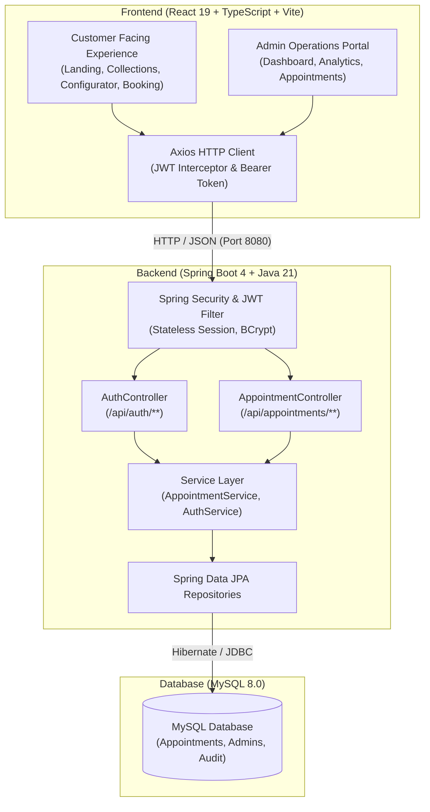
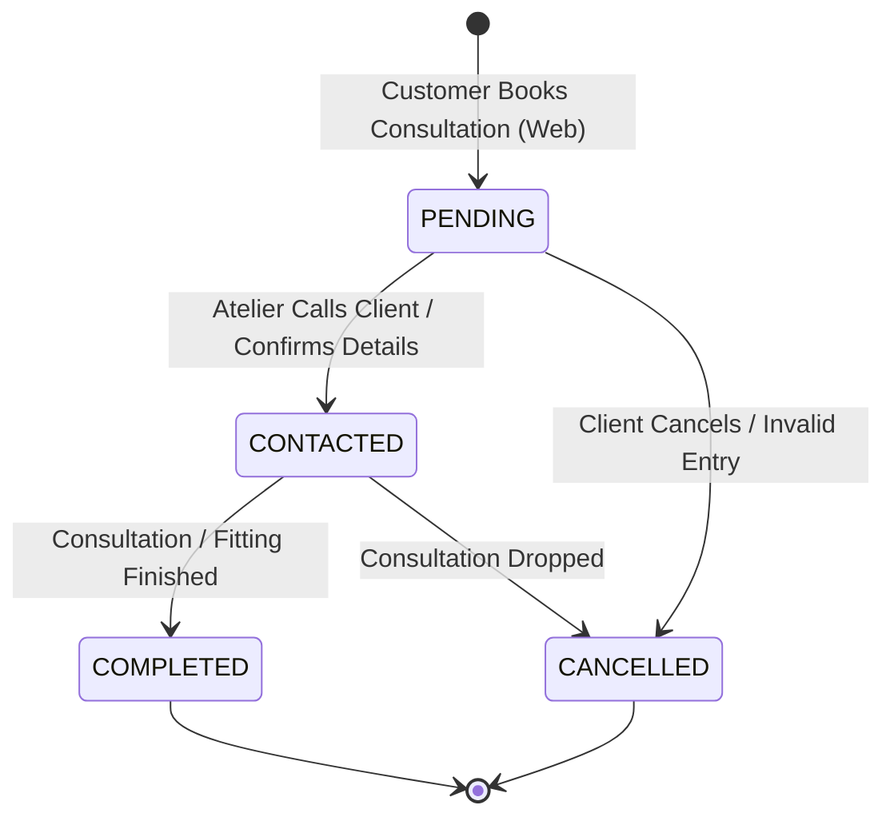

# Terzi Murat — Bespoke Tailoring Platform

A modern, full-stack bespoke tailoring platform and atelier operations management suite built for **Terzi Murat**, an artisanal tailoring house with roots dating back to 1996 and operating in Gebze, Kocaeli since 2004.

The platform bridges heritage bespoke tailoring with modern digital craftsmanship. It offers an interactive customer-facing custom suit configurator and consultation booking flow, complemented by a secure, dark-luxury administrative management dashboard.

> **Language & Market Note:** While this documentation is provided in English for technical reviewers and portfolio inspection, the application interface, business workflows, customer notifications, and atelier operations are fully localized in Turkish (`tr-TR`).

---

## Architecture & System Design

The system follows a decoupled client-server architecture. The frontend is a responsive single-page application built with React 19, Vite, and Tailwind CSS v4. The backend is a robust RESTful API powered by Spring Boot 4, Spring Security, and Spring Data JPA, backed by MySQL 8.



---

## Screens & Application Routes

### Customer Portal (Public)

| Route | View | Description |
| :--- | :--- | :--- |
| `/` | **Home / Atelier Showcase** | Hero showcase, curated groom suit collection (*Damatlık*), engagement suit collection (*Nişan Takımları*), craftsmanship values (*Ustalık*), and the Atelier Gallery. |
| `/about` | **About (*Hakkımızda*)** | Atelier heritage tracing the journey from 1996 textile origins to the 2004 founding of the Gebze atelier and bespoke tailoring philosophy. |
| `/create-your-suit` | **Suit Configurator** | Interactive suit builder allowing selection of luxury fabrics, lapel types, and button configurations with real-time price calculation and visual previews. |
| `/appointment` | **Appointment Booking** | Dual-mode booking: handles consultation requests for custom-configured suits (with spec breakdown) as well as general bespoke consultations. |

### Admin Operations Portal (Protected)

| Route | View | Description |
| :--- | :--- | :--- |
| `/admin/login` | **Admin Authentication** | Secure admin login utilizing JWT authentication with password hashing and session validation. |
| `/admin` | **Operations Dashboard** | Real-time metrics, appointment statistics, active conversion rates, Recharts annual trend analysis, status donut chart, and recent appointment feed. |
| `/admin/appointments` | **Appointment Management** | Searchable and filterable appointment pipeline with instant search by name or phone, status pills, inline status transitions, detailed modal inspection, and pagination. |

---

## Key Features

### 1. Bespoke Suit Configurator (`/create-your-suit`)
- **Interactive Visual Customization:** Real-time visual feedback for fabric textures, lapel cuts, and button stylings.
- **Dynamic Price Engine:** Live price recalculation in Turkish Lira (TRY / ₺) based on fabric grades and tailoring details.
- **Seamless Booking Handoff:** Selected configurations (fabric, lapel, buttons, estimated price) automatically carry over into the consultation booking flow with customer-facing Turkish labels.

### 2. Dual Appointment Booking (`/appointment`)
- **Configured Consultation:** Displays a summary card detailing the chosen suit specifications and estimated pricing when navigated from the configurator.
- **General Consultation:** Allows direct booking for clients seeking bespoke tailoring, wedding suits, alterations, or private consultations.
- **Robust Client Validation:** Sanitized customer data inputs (full name, phone number, preferred consultation date, optional notes) with user feedback toasts.

### 3. Admin Operations & Analytics (`/admin`)
- **Key Performance Indicators:** Instant summary cards for Total Appointments, Pending (*Bekleyen*), Contacted (*İletişime Geçildi*), Completed (*Tamamlandı*), and Cancelled (*İptal Edildi*).
- **Executive Analytics:** Calculation of today's bookings, rolling 7-day volume, completion rate percentage, and active pipeline volume.
- **Visual Intelligence:**
  - *Monthly Appointment Trend Chart:* Dynamic Recharts area/bar chart displaying the active calendar year up to the current month.
  - *Status Distribution Donut:* Visual breakdown of appointment stages.
  - *Recent Activity Summary:* Chronological feed of recent bookings with instant status indicators.

### 4. Appointment Lifecycle Management (`/admin/appointments`)
- **Multi-Filter & Instant Search:** Filter by status (`ALL`, `PENDING`, `CONTACTED`, `COMPLETED`, `CANCELLED`) combined with live debounced search across client names and phone numbers.
- **Responsive Presentation:** Fluid desktop table transforming into touch-optimized card views on mobile and tablet screens.
- **Direct Status Modification:** Inline dropdowns enabling immediate status transitions with real-time server synchronization.
- **Comprehensive Detail Modal:** Full audit view of client details, consultation date, requested suit specifications, price estimates, and custom notes.
- **Server-Friendly Pagination:** Paginated views (10 items per page) with boundary protection.

### 5. Authentication & Security Architecture
- **Stateless JWT Flow:** Spring Security stateless session architecture with `JwtAuthenticationFilter` and JJWT 0.12.7.
- **Automatic Token Expiry & Refresh Interception:** Axios response interceptors handle HTTP 401 unauthorized responses, safely purging stored tokens and redirecting to `/admin/login`.
- **Protected Routing:** React Router v7 `ProtectedRoute` guards administrative screens against unauthenticated access.

---

## Tech Stack

### Frontend
- **Framework & Runtime:** [React 19](https://react.dev/) with [TypeScript](https://www.typescriptlang.org/)
- **Build Tool:** [Vite 8](https://vitejs.dev/)
- **Styling & Design System:** [Tailwind CSS v4](https://tailwindcss.com/) (`@tailwindcss/vite`) with custom luxury color palette
- **Routing:** [React Router v7](https://reactrouter.com/)
- **HTTP Client:** [Axios](https://axios-http.com/) (with request/response interceptors for Bearer auth)
- **Data Visualization:** [Recharts](https://recharts.org/)
- **Icons & UI Utilities:** [Lucide React](https://lucide.dev/), `clsx`, `tailwind-merge`, `class-variance-authority`
- **User Notifications:** [React Hot Toast](https://react-hot-toast.com/)
- **Document Head Management:** [React Helmet Async](https://github.com/staylor/react-helmet-async)

### Backend
- **Framework:** [Spring Boot 4.1.0](https://spring.io/projects/spring-boot)
- **Language & Runtime:** Java 21 (LTS)
- **Security:** Spring Security 6+ with JWT (`io.jsonwebtoken:jjwt-api:0.12.7`) & BCrypt password encoding
- **Persistence & ORM:** Spring Data JPA with Hibernate
- **Validation:** Jakarta Validation (`spring-boot-starter-validation`)
- **Database Driver:** MySQL Connector/J (`com.mysql:mysql-connector-j`)
- **Productivity:** Project Lombok

### Infrastructure & Database
- **Database Engine:** MySQL 8.0
- **Containerization:** Docker Compose for local database provisioning

---

## Repository Structure

```text
terzi-murat-platform/
├── backend/
│   └── terzi-murat-backend/
│       ├── .mvn/
│       ├── src/
│       │   ├── main/
│       │   │   ├── java/com/terzimurat/terzimuratbackend/
│       │   │   │   ├── auth/              # AuthController, AuthService, DTOs
│       │   │   │   ├── config/            # SecurityConfig, CorsConfig
│       │   │   │   ├── controller/        # AppointmentController
│       │   │   │   ├── dto/               # Appointment DTOs & status requests
│       │   │   │   ├── entity/            # JPA entities (Appointment, Admin, enums)
│       │   │   │   ├── repository/        # Spring Data JPA repositories
│       │   │   │   ├── security/          # JWT filter, provider, entry point
│       │   │   │   └── service/           # AppointmentService & business logic
│       │   │   └── resources/
│       │   │       └── application.properties # Spring configuration & data sources
│       │   └── test/
│       ├── docker-compose.yml             # Local MySQL 8.0 container service
│       ├── mvnw / mvnw.cmd                # Maven wrappers
│       └── pom.xml                        # Maven dependencies & build configuration
├── frontend/
│   ├── public/                            # Static assets and brand imagery
│   ├── src/
│   │   ├── auth/                          # AuthContext, ProtectedRoute, auth utilities
│   │   ├── components/
│   │   │   ├── admin/                     # Dashboard charts, stats, tables, modals
│   │   │   ├── configurator/              # Suit builder steps, preview, controls
│   │   │   ├── home/                      # Hero, collections, gallery, about preview
│   │   │   ├── layout/                    # PublicLayout, AdminLayout, Header, Sidebar
│   │   │   └── shared/                    # Buttons, badges, toasts, scroll managers
│   │   ├── data/                          # Fabrics, lapels, buttons, suit catalog
│   │   ├── lib/                           # Axios client instance with interceptors
│   │   ├── pages/
│   │   │   ├── admin/                     # Dashboard, AdminAppointments, AdminLogin
│   │   │   ├── About.tsx                  # Brand history & atelier narrative
│   │   │   ├── Appointment.tsx            # Dual appointment booking page
│   │   │   ├── CreateSuit.tsx             # Bespoke suit configurator page
│   │   │   └── Home.tsx                   # Atelier landing experience
│   │   ├── routes/                        # AppRouter configuration
│   │   ├── types/                         # TypeScript interfaces (Appointment, Suit)
│   │   ├── App.tsx                        # Application root
│   │   └── main.tsx                       # React DOM entry point
│   ├── package.json                       # Frontend dependencies & npm scripts
│   ├── tsconfig.json                      # TypeScript configuration
│   └── vite.config.ts                     # Vite build configuration with Tailwind plugin
├── database/                              # Database schemas and seed scripts
├── docs/                                  # Architectural documentation & project notes
├── PROJECT_STATUS.md                      # Operational milestone history & tracking
└── README.md                              # Root project documentation
```

---

## Getting Started

### Prerequisites
- **Java Development Kit (JDK):** Version 21 or higher
- **Node.js:** Version 20.x or higher (LTS recommended) and `npm`
- **Database:** MySQL 8.0 running locally or via Docker
- **Git**

---

### 1. Database Setup

You can either run MySQL locally or launch the included Docker Compose configuration located in the backend directory:

```bash
# Navigate to the backend directory
cd backend/terzi-murat-backend

# Start the MySQL container
docker compose up -d
```

The database initializes with the following default configuration:
- **Host:** `localhost:3306`
- **Database Name:** `terzi_murat`

---

### 2. Backend Service Setup

The backend configuration uses environment variables or defaults configured in `application.properties`.

1. **Navigate to the backend service:**
   ```bash
   cd backend/terzi-murat-backend
   ```

2. **Configure environment variables (Optional / Recommended for custom setups):**
   ```bash
   # Linux / macOS
   export JWT_SECRET="your-256-bit-secret-key-goes-here-make-it-secure-and-long"
   export JWT_EXPIRATION=86400000

   # Windows (PowerShell)
   $env:JWT_SECRET="your-256-bit-secret-key-goes-here-make-it-secure-and-long"
   $env:JWT_EXPIRATION=86400000
   ```

3. **Build and start the Spring Boot application:**
   - On Windows:
     ```powershell
     .\mvnw.cmd spring-boot:run
     ```
   - On Linux / macOS:
     ```bash
     ./mvnw spring-boot:run
     ```

The backend server starts on **`http://localhost:8080`**.

---

### 3. Frontend Application Setup

1. **Navigate to the frontend directory:**
   ```bash
   cd frontend
   ```

2. **Install dependencies:**
   ```bash
   npm install
   ```

3. **Configure the environment file:**
   Create a `.env` file in the `frontend/` directory:
   ```env
   VITE_API_URL=http://localhost:8080/api
   ```

4. **Launch the development server:**
   ```bash
   npm run dev
   ```

The frontend application will be available at **`http://localhost:5173`**.

5. **Run production build verification:**
   ```bash
   npm run build
   ```

---

## Environment Configuration

### Frontend (`frontend/.env`)
| Variable | Description | Example / Default |
| :--- | :--- | :--- |
| `VITE_API_URL` | Base endpoint URL for the Spring Boot REST API | `http://localhost:8080/api` |

### Backend (`application.properties` / Environment)
| Variable / Property | Description | Example / Default |
| :--- | :--- | :--- |
| `server.port` | HTTP listening port for Spring Boot | `8080` |
| `spring.datasource.url` | JDBC connection string for MySQL | `jdbc:mysql://localhost:3306/terzi_murat?... ` |
| `spring.datasource.username` | Database user | `root` |
| `spring.datasource.password` | Database password | *Local password or secret* |
| `JWT_SECRET` (`jwt.secret`) | Cryptographic secret for signing and verifying tokens | *Secure base64-encoded string* |
| `JWT_EXPIRATION` (`jwt.expiration`)| Token validity period in milliseconds | `86400000` (24 hours) |

---

## REST API Reference

All application endpoints are served under the `/api` prefix.

### Authentication Endpoints

#### Admin Login
```http
POST /api/auth/login
```
- **Access:** Public
- **Request Body:**
  ```json
  {
    "email": "admin@terzimurat.com",
    "password": "your-password"
  }
  ```
- **Response (`200 OK`):**
  ```json
  {
    "token": "eyJhbGciOiJIUzI1NiIsInR5cCI6IkpXVCJ9...",
    "type": "Bearer",
    "email": "admin@terzimurat.com",
    "role": "ROLE_ADMIN"
  }
  ```

---

### Appointment Endpoints

#### Create Appointment
```http
POST /api/appointments
```
- **Access:** Public (Customer facing)
- **Request Body (Configured Suit Example):**
  ```json
  {
    "customerName": "Ahmet Yılmaz",
    "phone": "0532 123 45 67",
    "appointmentDate": "2026-09-15T14:30:00",
    "notes": "Düğün için özel damatlık dikimi.",
    "suitDetails": "İtalyan Yün - Sivri Yaka - 2 Düğme",
    "estimatedPrice": 38500.00
  }
  ```
- **Response (`201 Created`):** Returns the created `AppointmentResponse` object with assigned ID and `status: "PENDING"`.

#### List Appointments
```http
GET /api/appointments
GET /api/appointments?status=PENDING
```
- **Access:** Protected (`Bearer <token>`)
- **Query Parameters:**
  - `status` (Optional): Filter by `PENDING`, `CONTACTED`, `COMPLETED`, or `CANCELLED`.
- **Response (`200 OK`):** Array of `AppointmentResponse` objects.

#### Get Appointment by ID
```http
GET /api/appointments/{id}
```
- **Access:** Protected (`Bearer <token>`)
- **Response (`200 OK`):** Detailed `AppointmentResponse` object.

#### Update Appointment Status
```http
PUT /api/appointments/{id}/status
PATCH /api/appointments/{id}/status
```
- **Access:** Protected (`Bearer <token>`)
- **Request Body:**
  ```json
  {
    "status": "CONTACTED"
  }
  ```
- **Response (`200 OK`):** Updated `AppointmentResponse` object.

---

## Appointment Lifecycle & Workflow

Appointments transition through a defined lifecycle managed through the admin panel:



| Internal Status | Turkish Display Label | Meaning |
| :--- | :--- | :--- |
| `PENDING` | **Bekleyen** | New consultation submitted by the client via web; awaiting atelier contact. |
| `CONTACTED` | **İletişime Geçildi** | The atelier has contacted the client to confirm appointment time and details. |
| `COMPLETED` | **Tamamlandı** | In-person consultation or measurement fitting has successfully concluded. |
| `CANCELLED` | **İptal Edildi** | Consultation was cancelled by customer request or scheduling conflict. |

---

## Design System & Atelier Aesthetic

The user interface reflects the tactile elegance of high-end tailoring:
- **Color Palette:**
  - **Tailor Gold (`#C8A45D`):** Primary accent color representing master stitching, precision, and craftsmanship.
  - **Deep Obsidian (`#0B0B0B` / `#050505`):** Luxury dark backdrop reminiscent of midnight fabrics and atelier interiors.
  - **Translucent Charcoal (`#141414` / `#1A1A1A`):** Card and container overlays with subtle borders (`border-stone-800`).
- **Typography:**
  - **Headings & Accents:** *Cormorant Garamond* (editorial luxury serif).
  - **Body & Data Interfaces:** *Inter* (crisp, high-legibility geometric sans-serif for forms, tables, and analytics).
- **Interactive Polish:** Subtle border glows, micro-interactions on hover, responsive touch targets, and toast feedback.

---

## Business & Brand Context

- **Heritage:** Founder craftsmanship roots began in **1996** in textile manufacturing across Pendik, Kartal, Kaynarca, İçmeler, and denim leather production.
- **Atelier Establishment:** In **2004**, Terzi Murat opened its dedicated bespoke atelier on Yeni Bağdat Caddesi in Gebze.
- **Current Atelier Address:** Hacıhalil Mahallesi, 1218. Sk. 7-3, Gebze / Kocaeli.
- **Specializations:** Bespoke men's suits, groom tuxedos (*damatlık*), engagement suits (*nişan takımları*), personalized fabric tailoring, and precision hand-finishing.

---

## Current Project Status & Milestones

The platform is maintained with disciplined version control and verified milestone deliveries:

- **Milestone 1 — Responsive & Navigation Polish:** Resolved responsive navigation, mobile menus, and layout scaling.
- **Milestone 2 — Dual Appointment Flow:** Implemented distinct handling for configured custom suits vs. general bespoke consultations.
- **Milestone 3 — Real Atelier Heritage Integration:** Replaced generic placeholders with authentic 1996/2004 brand narrative and established the dedicated `/about` view.
- **Milestone 4 — Suit Configurator UI Polish & Localization:** Upgraded `/create-your-suit` with Turkish localization, swatch previews, and seamless appointment handoff.
- **Milestone 5 — Admin Responsive & UI Consistency Polish:** Optimized admin dashboard and appointment management for all screen sizes, resolved overflow issues, and standardized UI tokens.

*For granular changelogs and implementation notes, refer to [`PROJECT_STATUS.md`](./PROJECT_STATUS.md).*

---

## Security Best Practices

- **Zero Hardcoded Secrets:** Production credentials, JWT secrets, and database passwords must be provided strictly through environment variables.
- **Stateless Tokens:** No server session state is retained; credentials are authenticated on every request using signed HMAC tokens.
- **Input Validation:** All request payloads undergo validation via Jakarta Validation annotations (`@Valid`, `@NotBlank`, `@Size`, `@NotNull`).
- **CORS & CSRF:** Cross-Origin Resource Sharing is centrally governed in `CorsConfig` / `SecurityConfig`; CSRF is disabled appropriately for pure stateless REST API consumption.

---

## Planned Roadmap

- [ ] Automated SMS / WhatsApp consultation reminders for clients upon appointment confirmation.
- [ ] Multi-admin role hierarchy (Master Tailor, Atelier Assistant).
- [ ] Direct digital measurement archive attached to client appointment records.
- [ ] Multi-language support (English / Turkish toggle) for international bespoke clientele.

---

## Portfolio & Author

Developed by **Abdullah Turgut** for **Terzi Murat**.
- **Repository:** [`AbdullahTurgut/bespoke-tailoring-platform`](https://github.com/AbdullahTurgut/bespoke-tailoring-platform)
- **License:** Proprietary — All Rights Reserved © Terzi Murat
